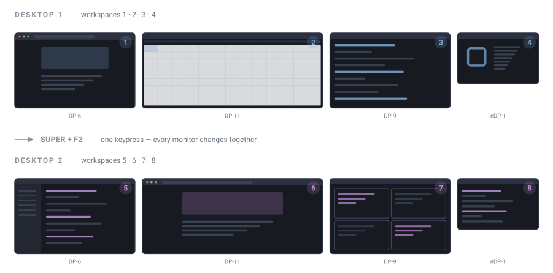

# omarchy-desktop-groups

Windows-style virtual desktops for Omarchy/Hyprland — one keypress moves every monitor to a new set of workspaces.

**Requires two or more monitors.** On a single screen it disables itself automatically (see [Single monitor](#single-monitor)).

## The problem this solves

On Windows, <kbd>Win</kbd>+<kbd>Ctrl</kbd>+<kbd>←</kbd>/<kbd>→</kbd> switches **all of your monitors at once**. A virtual desktop spans every screen: flip to desktop 2 and all three monitors change together to a fresh set of windows. Your "work" layout and your "personal" layout are each one keypress away, across the whole desk.

Hyprland cannot do this. **A workspace belongs to exactly one monitor.** There is no built-in concept of a desktop that spans screens, and no dispatcher that switches them together. `SUPER+1` moves *one* screen. To change a four-monitor setup you press four different keys and remember which workspace lives where.

That is the gap. This plugin closes it.

A **desktop** here is one workspace per monitor:



With four monitors and three desktops:

|                                | DP-6 (left) | DP-11 | DP-9 | eDP-1 (right) |
| ------------------------------ | ----------- | ----- | ---- | ------------- |
| <kbd>SUPER</kbd>+<kbd>F1</kbd> | 1           | 2     | 3    | 4             |
| <kbd>SUPER</kbd>+<kbd>F2</kbd> | 5           | 6     | 7    | 8             |
| <kbd>SUPER</kbd>+<kbd>F3</kbd> | 9           | 10    | 11   | 12            |

One keypress switches all four. Your existing <kbd>SUPER</kbd>+<kbd>1</kbd>..<kbd>0</kbd> keys are untouched and still move a single screen.

### It also fixes scrambled workspace assignment

A second, smaller problem comes free. By default each monitor claims the lowest unused workspace as it comes up, **in DRM probe order** — which routinely bears no relation to how the screens sit on your desk. On the author's machine:

```
eDP-1 = id 0    DP-6 = id 1    DP-9 = id 2    DP-11 = id 3
```

The laptop is `id 0` while physically at the far *right*, so workspace 1 landed on the laptop and the second monitor from the left showed workspace 4. The order also reshuffles on every reload and hotplug.

This plugin pins every workspace to a monitor, **sorted by x coordinate — left to right as you see them**. Stable across reboots, hotplug, and undocking.

## Install

Two halves: the Hyprland module does the work, the bar widget shows and configures it. The widget is optional.

```bash
omarchy plugin add https://github.com/mdelgert/omarchy-desktop-groups.git --enable
~/.config/omarchy/plugins/io.github.mdelgert.desktop-groups/install-hyprland.sh
```

The first line installs the bar widget. The second wires the Hyprland module into your config — switching works without the widget, but not the other way round.

Without the bar widget at all:

```bash
git clone https://github.com/mdelgert/omarchy-desktop-groups.git
cd omarchy-desktop-groups
./install-hyprland.sh
```

Choose a desktop count at install time:

```bash
DESKTOPS=4 ./install-hyprland.sh
```

## Uninstall

**Remove the Hyprland module** — deletes `~/.config/hypr/desktop-groups.lua` and strips the `require` line from `hyprland.lua`, backing it up first:

```bash
~/.config/omarchy/plugins/io.github.mdelgert.desktop-groups/uninstall-hyprland.sh
```

Or from a clone: `./uninstall-hyprland.sh`

**Remove the bar widget:**

```bash
omarchy plugin remove io.github.mdelgert.desktop-groups
```

**Remove the saved settings** (optional — the two panel toggles):

```bash
rm -f ~/.local/state/omarchy/desktop-groups.conf
```

### What uninstalling does and does not do

- Bindings and workspace rules live only in the running compositor, so they are gone after the reload the uninstaller performs. <kbd>SUPER</kbd>+<kbd>F1</kbd>..<kbd>F3</kbd> become unbound again.
- `binds:hide_special_on_workspace_change` reverts to whatever your own config sets, since the module is no longer overriding it.
- **No window and no workspace is moved.** Anything sitting on workspace 7 stays on workspace 7. Hyprland simply stops pinning workspaces to monitors, so placement returns to probe order on the next reload.
- Nothing in `~/.config/hypr/` other than the `require` line in `hyprland.lua` is touched. Your `monitors.lua` is never modified by the installer.

To turn the feature off **without uninstalling**, use the toggle in the bar panel — or:

```bash
hyprctl eval 'require("hypr.desktop-groups").set_enabled(false)'
```

That persists across reloads and reboots.

## Monitor requirements

### Single monitor

The module **stands down entirely** below two monitors: no workspace rules, no bindings, and `switch()` becomes a no-op. The bar widget hides itself.

This is deliberate. With one screen a "desktop" collapses to a single workspace — which is exactly what <kbd>SUPER</kbd>+<kbd>1</kbd>..<kbd>0</kbd> already switches between. A second set of keys doing the same thing would be noise, and it would shadow <kbd>SUPER</kbd>+<kbd>F1</kbd>..<kbd>F3</kbd> for no benefit.

Undock to one screen and it deactivates; plug a second in and it returns, because rules rebuild on `monitor.added`, `monitor.removed`, and `monitor.layout_changed`.

### Two or more

Nothing is hardcoded to a monitor count. The layout is derived from however many are connected. Two monitors with three desktops:

|                                | left | right |
| ------------------------------ | ---- | ----- |
| <kbd>SUPER</kbd>+<kbd>F1</kbd> | 1    | 2     |
| <kbd>SUPER</kbd>+<kbd>F2</kbd> | 3    | 4     |
| <kbd>SUPER</kbd>+<kbd>F3</kbd> | 5    | 6     |

Mirrored outputs are skipped — they duplicate another screen, so giving one its own workspace would strand it out of view.

## Configure

Edit the `setup()` call at the bottom of `~/.config/hypr/hyprland.lua`:

```lua
require("hypr.desktop-groups").setup({
  desktops = 3,
  bind = "SUPER + F%d",
  slots = nil,
})
```

| Option     | Default       | Meaning                                                                    |
| ---------- | ------------- | -------------------------------------------------------------------------- |
| `desktops` | `3`           | How many desktops to create.                                                |
| `bind`     | `"SUPER + F%d"` | Key pattern for the switch bindings; `%d` is the desktop number.           |
| `slots`    | monitor count | Workspaces reserved per desktop. See below.                                 |

### About `slots`

`slots` is the stride between desktops — with 4 slots, desktop 2 starts at workspace 5. It defaults to the number of monitors connected when `setup()` runs.

**If you dock and undock, set it explicitly to your maximum monitor count.** Otherwise the stride follows the live monitor count and the numbering shifts when a screen disappears: desktop 2 starts at 5 with four monitors but at 4 with three. Pinning `slots` keeps the mapping stable and leaves the tail unused.

```lua
require("hypr.desktop-groups").setup({ desktops = 3, slots = 4 })
```

### F-keys

`F1`–`F12` are unbound in stock Omarchy, which is why they are the default. Arrow keys would match Windows more closely, but every <kbd>SUPER</kbd>/<kbd>SHIFT</kbd>/<kbd>CTRL</kbd>/<kbd>ALT</kbd> arrow combination is already taken — <kbd>SUPER</kbd>+<kbd>CTRL</kbd>+arrow in particular is "Move grouped window focus". If you rebind, check what is free first:

```bash
omarchy menu keybindings --print
```

## Bar widget


A single `▦` icon (leftmost above). Deliberately no digits: the stock workspace widget is already a row of numbers, and anything numeric beside it reads as one more of them.

The current desktop is in the tooltip on hover, and in the panel on click — which is where you look when you actually want to know. <kbd>SUPER</kbd>+<kbd>F1</kbd> is not discoverable on its own, so the panel is also where the feature explains itself.

Two switches live there:

| Switch | Does |
| ------ | ---- |
| **Desktop groups** | Turn the bindings and workspace pinning off. Hyprland returns to its own workspace placement; no window is moved. |
| **Hide scratchpad on switch** | `binds:hide_special_on_workspace_change`. A desktop switch changes the workspace on every monitor at once, which makes this far more noticeable than on a single screen. |

Both persist to `~/.local/state/omarchy/desktop-groups.conf` and are re-applied by `setup()` on every reload.

The widget also has `desktops`, `slots`, and `bindPrefix` settings in the bar's widget configuration. These mirror the Lua values because the bar and the compositor config are configured in different places — if they disagree, the number in the tooltip goes wrong while the switching stays correct. The Lua side is the source of truth.

## How it compares

Three separate concerns, often confused:

| Layer | Decides | Project |
| ----- | ------- | ------- |
| **Assignment** | which monitor a workspace lives on | this, and [omarchy-local-workspaces](https://github.com/selmant/omarchy-local-workspaces) |
| **Switching** | how you move between them | this, and omarchy-local-workspaces |
| **Display** | which buttons each bar draws | [workspaces-per-monitor](https://github.com/ElRuckh/workspaces-per-monitor) |

The meaningful comparison is with **omarchy-local-workspaces**, which implements the opposite model:

|  | Model | <kbd>SUPER</kbd>+<kbd>1</kbd> means |
| --- | --- | --- |
| **omarchy-local-workspaces** | niri-style: each monitor owns an independent stack | "workspace 1 **on the monitor I'm looking at**" |
| **omarchy-desktop-groups** | Windows-style: desktops span every monitor | unchanged — <kbd>SUPER</kbd>+<kbd>F1</kbd> moves all monitors together |

Neither is a superset of the other. Pick the one matching how you think about screens: independent monitors, or one desktop across all of them. Both write workspace rules and will fight if installed together.

`workspaces-per-monitor` is a bar widget and composes fine with this one — worth adding, since Omarchy's stock workspace widget draws *every* workspace on *every* bar.

## Notes

- **Workspace rules do not move workspaces that already exist.** After install, a reload registers the rules but leaves current workspaces where they sit. Log out and back in for a clean mapping, or just press <kbd>SUPER</kbd>+<kbd>F1</kbd>.
- **Undocking** is handled: rules rebuild on monitor events, and switching skips monitors that are gone. Windows on a vanished monitor migrate as Hyprland sees fit and do not automatically return.
- **Nothing is unbound.** No stock Omarchy binding is replaced.
- The bar widget tracks the focused workspace from Hyprland's event stream rather than the Quickshell model, which otherwise trails a switch by a second or more.

## Requirements

Hyprland with Lua configuration and an Omarchy-style `~/.config/hypr/hyprland.lua`. Two or more monitors. Developed and tested against Hyprland 0.56.2.

## License

MIT
